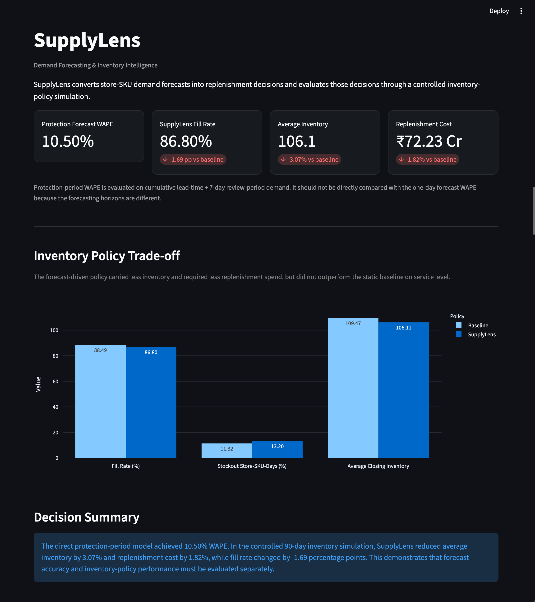
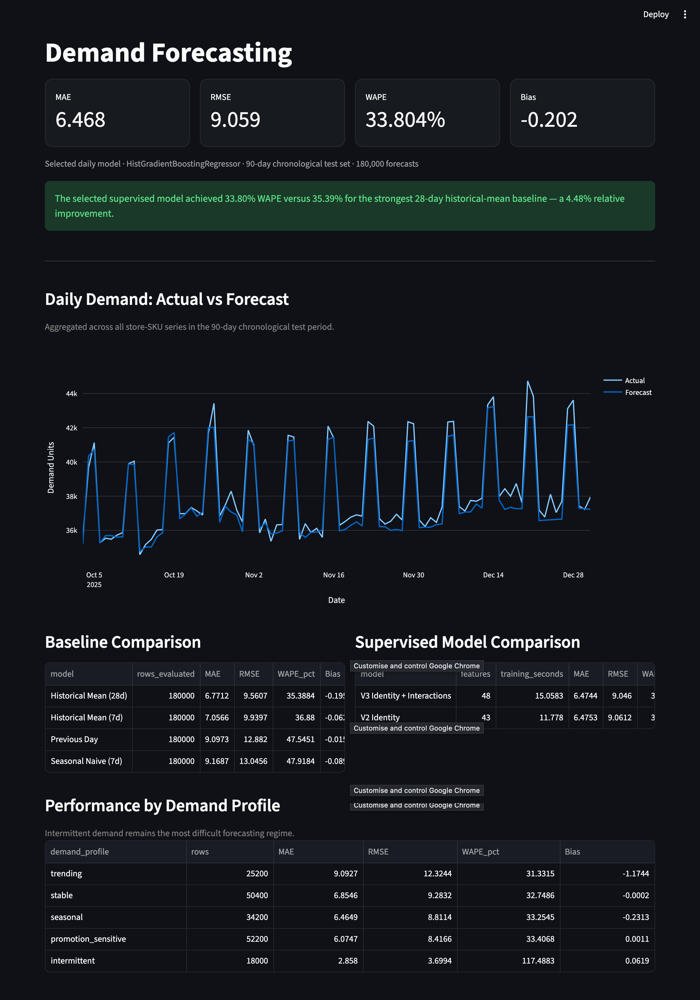
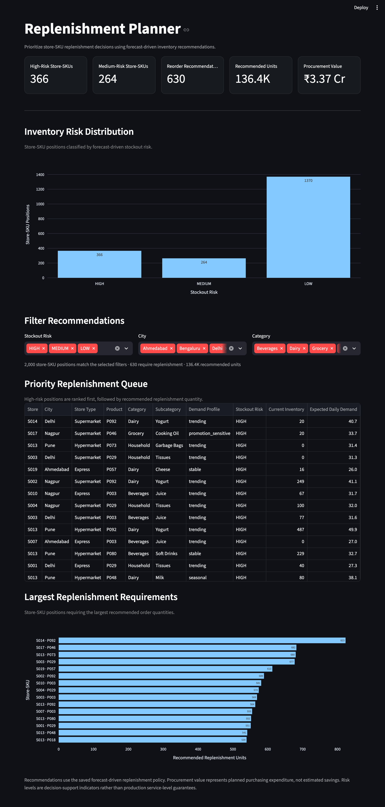
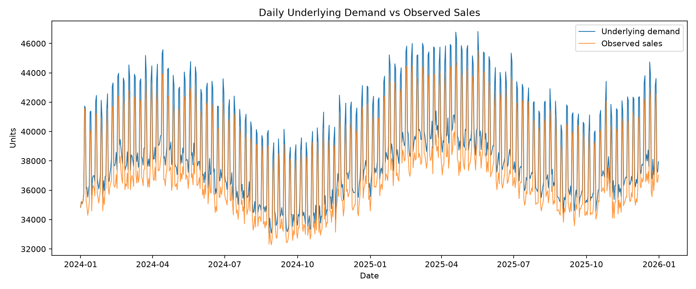
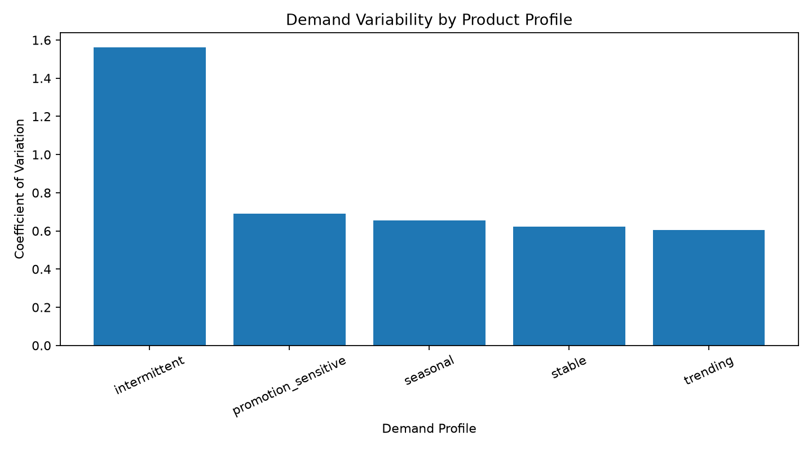
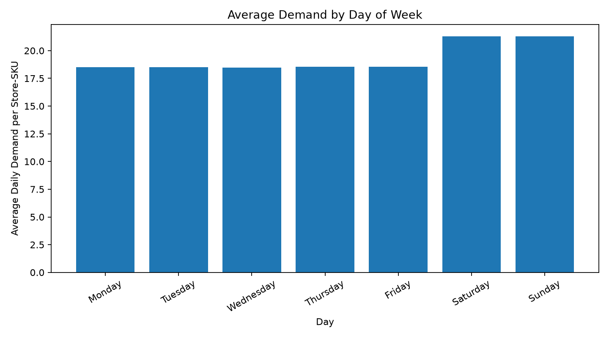
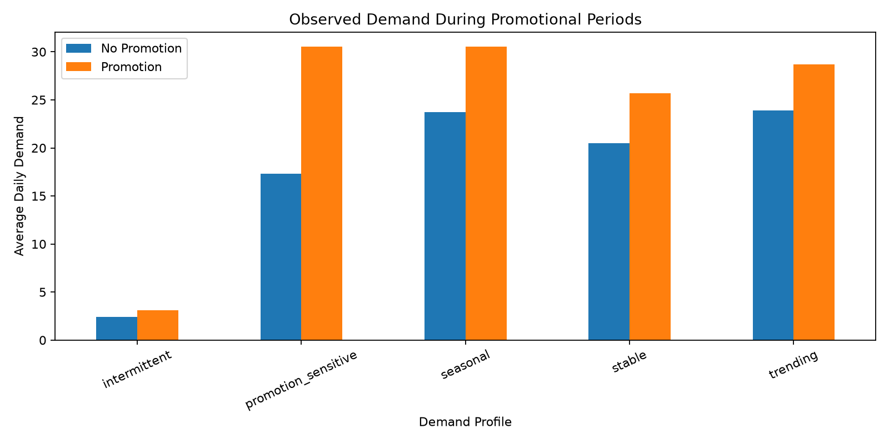

# SupplyLens — Demand Forecasting & Inventory Intelligence

SupplyLens is an end-to-end retail demand forecasting and inventory decision-support system that converts historical store-SKU demand into replenishment recommendations.

The project covers the full data science workflow: synthetic retail data generation, PostgreSQL data modeling and validation, SQL analysis, leakage-safe time-series feature engineering, forecasting, inventory policy design, backtesting, and a stakeholder-facing Streamlit dashboard.

> **Core business question:** How much of each product will we need, and when should we reorder it?

---

## Dashboard



The Streamlit application provides four decision-support views:

- **Executive Overview** — forecasting and inventory-policy KPIs
- **Demand Forecasting** — actual vs predicted demand and model evaluation
- **Inventory Intelligence** — service-level, stockout, inventory, and cost trade-offs
- **Replenishment Planner** — prioritized store-SKU reorder recommendations

### Demand Forecasting



### Replenishment Planner



---

## Business Problem

Retail inventory planning involves a fundamental trade-off.

Holding too little inventory increases stockouts and lost sales. Holding too much inventory increases working capital requirements and carrying costs.

SupplyLens approaches this as a connected forecasting and decision problem:

1. Estimate future demand at the **store × SKU × day** level.
2. Translate forecasts into safety stock and reorder points.
3. Generate actionable replenishment recommendations.
4. Backtest the resulting policy against a baseline inventory strategy.
5. Measure both predictive accuracy and operational consequences.

This distinction matters: a more accurate forecast does not automatically produce a better inventory policy.

---

## Dataset

SupplyLens uses a reproducible synthetic retail dataset designed to preserve operational characteristics such as promotions, demand variability, inventory constraints, and stockouts.

| Dimension | Value |
|---|---:|
| Stores | 20 |
| Products | 100 |
| Store-SKU series | 2,000 |
| Date range | 2024-01-01 to 2025-12-31 |
| Daily history | 731 days |
| Store-SKU-day observations | 1,462,000 |
| Total latent demand | 28,230,586 units |
| Observed sales | 27,359,942 units |
| Estimated lost demand | 870,644 units |
| Stockout observations | 43,986 |
| Stockout rate | 3.01% |
| Promotion coverage | 6.32% |

The simulation retains both **latent demand** and **observed sales**. This makes it possible to quantify stockout-driven demand censoring during experimentation.

In a real retail system, unconstrained demand is generally not directly observable when inventory reaches zero. Demand estimation under stockouts would therefore require additional modeling or business assumptions.

---

## System Architecture

```text
Synthetic Retail Data
        |
        v
PostgreSQL
Schema + Constraints + Data Quality
        |
        v
SQL Business Analysis
        |
        v
Python EDA
        |
        v
Leakage-Safe Time-Series Features
        |
        +----------------------+
        |                      |
        v                      v
Daily Demand Forecast     Protection-Period Forecast
        |                      |
        +-----------+----------+
                    |
                    v
        Replenishment Policy
     Safety Stock + Reorder Point
                    |
                    v
        Inventory Policy Simulation
                    |
                    v
          Streamlit Dashboard
```

---

## Data Engineering & Quality

The PostgreSQL layer contains five core tables:

- `products`
- `stores`
- `promotions`
- `sales`
- `inventory`

The generated dataset loads approximately **2.94 million database rows** across these tables.

The database implementation includes:

- primary and foreign keys
- domain and range constraints
- indexes
- bulk PostgreSQL `COPY` ingestion
- repeatable loading
- automated data-quality checks

The final validation suite contains **16 data-quality checks**, all of which passed before downstream analysis.

SQL is also used for business analysis including revenue, lost-sales exposure, stockout behavior, product performance, store performance, promotion behavior, and inventory conditions.

One descriptive result was approximately **₹9.41B in observed revenue** and **₹305.32M in estimated lost-sales value** across the simulated period.

Promotion comparisons in this project are descriptive associations and should not be interpreted as causal treatment effects.

---

## Exploratory Analysis

EDA was used to understand demand behavior before selecting a forecasting strategy.

The analysis examines:

- latent demand vs observed sales
- stockout censoring
- demand-profile variability
- weekly seasonality
- promotion behavior
- store-SKU demand distributions

### Demand vs Observed Sales



### Demand Profile Variability



### Weekday Demand



### Promotion Demand



The final forecasting target is **latent `demand_units`**, not observed sales, because observed sales can be censored when inventory is unavailable.

---

## Leakage-Safe Feature Engineering

Forecasting features are constructed using information available strictly before the prediction timestamp.

The feature set includes:

- demand lags: 1, 7, 14, and 28 days
- rolling historical demand statistics
- expanding historical averages
- calendar features
- product/store context
- pricing information
- promotion indicators
- demand-profile information

The resulting feature dataset contains approximately **1.46 million observations and 50 columns**.

Chronological splitting is used instead of random train/test splitting to preserve the temporal structure of the forecasting problem.

---

## Forecasting Baselines

Several historical forecasting rules were evaluated before supervised modeling.

The strongest baseline was the **28-day historical mean** on the final 90-day chronological test period.

| Metric | 28-Day Mean Baseline |
|---|---:|
| MAE | 6.771 |
| RMSE | 9.561 |
| WAPE | 35.388% |
| Bias | -0.196 |

The test period covers:

- **2025-10-03 to 2025-12-31**
- **90 days**
- **180,000 store-SKU-day forecasts**
- **2,000 store-SKU series**

---

## Supervised Demand Forecasting

The selected daily forecasting model is a `HistGradientBoostingRegressor` using leakage-safe historical, calendar, pricing, promotion, store, product, and demand-profile information.

Multiple controlled model configurations were evaluated. The selected configuration was retained because it provided the strongest MAE/WAPE performance while keeping the pipeline comparatively simple.

### Final Daily Forecast Performance

| Metric | Baseline | Selected Model |
|---|---:|---:|
| MAE | 6.771 | **6.468** |
| RMSE | 9.561 | **9.059** |
| WAPE | 35.388% | **33.804%** |
| Bias | -0.196 | -0.202 |

The supervised model reduced WAPE by **4.48% relative to the strongest baseline**.

The model is evaluated on a held-out chronological period rather than a random split.

Intermittent-demand series remain more difficult to forecast and are an identified limitation.

---

## Protection-Period Forecasting

Daily forecasting is useful for measuring predictive performance, but replenishment decisions depend on demand across the period during which inventory must provide protection.

SupplyLens therefore also trains a direct model for cumulative demand across:

```text
supplier lead time + 7-day review period
```

Only training observations with complete future target horizons are used.

### Protection-Period Results

| Metric | Result |
|---|---:|
| Evaluable test observations | 149,540 |
| MAE | 30.442 |
| RMSE | 44.304 |
| WAPE | **10.498%** |
| Bias | -2.333 |

The **10.498% protection-period WAPE should not be directly compared with the 33.804% one-day WAPE**. They represent different prediction targets and forecast horizons.

---

## Inventory Intelligence

Forecasts are converted into inventory decisions using:

- expected demand
- supplier lead time
- demand variability
- safety stock
- reorder points
- current inventory
- target inventory

The policy uses a service factor of:

```text
z = 1.65
```

with a **7-day review period**.

### Replenishment Recommendations

The final planning snapshot contains **2,000 store-SKU decisions**.

| Metric | Result |
|---|---:|
| Store-SKU decisions | 2,000 |
| Reorder recommendations | 630 |
| Recommended replenishment | 136,359 units |
| Estimated procurement value | ₹33.68M |
| High-risk decisions | 366 |
| Medium-risk decisions | 264 |
| Low-risk decisions | 1,370 |

The estimated replenishment cost represents **procurement expenditure**, not savings.

---

## Inventory Policy Backtest

A controlled 90-day simulation compares the SupplyLens forecast-driven policy with the baseline replenishment strategy.

| Metric | Baseline | SupplyLens |
|---|---:|---:|
| Demand | 3,444,114 | 3,444,114 |
| Fulfilled units | 3,047,775 | 2,989,405 |
| Lost sales units | 396,339 | 454,709 |
| Fill rate | **88.49%** | 86.80% |
| Stockout store-SKU-days | **20,372** | 23,757 |
| Avg. closing inventory | 109.47 | **106.11** |
| Replenishment units | 3,001,438 | **2,951,686** |
| Replenishment cost | ₹735.64M | **₹722.28M** |

### Operational Impact

Compared with the baseline policy, SupplyLens produced:

- **3.07% lower average closing inventory**
- **1.82% lower replenishment cost**
- **1.69 percentage-point lower fill rate**
- **14.73% more lost-sales units**
- **16.62% more stockout store-SKU-days**

This is intentionally reported as a trade-off rather than presented as a policy win.

The forecasting model improved predictive accuracy, but the selected inventory-policy parameters converted those forecasts into a leaner inventory position at the expense of service level.

No post-hoc tuning was performed against the held-out test simulation to manufacture a favorable result.

This demonstrates an important operational data science principle:

> **Predictive improvement and decision improvement are not the same objective.**

---

## Technology Stack

**Languages & Analytics**

- Python
- SQL
- pandas
- NumPy
- Matplotlib

**Machine Learning**

- scikit-learn
- HistGradientBoostingRegressor
- time-series feature engineering
- chronological model evaluation

**Data Engineering**

- PostgreSQL
- Psycopg 3
- relational schema design
- SQL data-quality validation
- bulk `COPY` ingestion

**Application**

- Streamlit
- Plotly

**Development**

- Git
- GitHub
- Python virtual environments

---

## Repository Structure

```text
SupplyLens/
├── dashboard/
│   └── app.py
├── data/
│   ├── processed/
│   │   └── .gitkeep
│   └── raw/
│       └── .gitkeep
├── docs/
│   └── images/
│       ├── eda/
│       ├── demand-forecasting.png
│       ├── executive-overview.png
│       └── replenishment-planner.png
├── src/
│   ├── analysis/
│   │   └── exploratory_analysis.py
│   ├── data_generation/
│   │   └── generate_data.py
│   ├── database/
│   │   └── load_data.py
│   ├── features/
│   │   └── build_features.py
│   ├── inventory/
│   │   ├── build_policy_forecasts.py
│   │   ├── protection_period_forecast.py
│   │   ├── replenishment_policy.py
│   │   └── simulate_policy.py
│   ├── models/
│   │   ├── baseline_forecasts.py
│   │   ├── gradient_boosting_forecast.py
│   │   └── hist_gradient_boosting_v2.py
│   └── sql/
│       ├── analysis.sql
│       ├── data_quality.sql
│       └── schema.sql
├── .gitignore
├── README.md
└── requirements.txt
```

Generated raw and processed datasets are intentionally excluded from Git because several artifacts are large and can be reproduced from the source pipeline.

---

## Running the Project

### 1. Clone the repository

```bash
git clone https://github.com/yusufdhansay/SupplyLens.git
cd SupplyLens
```

### 2. Create a virtual environment

```bash
python -m venv .venv
source .venv/bin/activate
```

### 3. Install dependencies

```bash
pip install -r requirements.txt
```

### 4. Generate the synthetic dataset

```bash
python src/data_generation/generate_data.py
```

### 5. Set up PostgreSQL

Create the local database:

```bash
createdb supplylens
```

Apply the schema:

```bash
psql -d supplylens -f src/sql/schema.sql
```

The Python loader connects to the local PostgreSQL database using:

```text
dbname=supplylens
```

so local PostgreSQL authentication must already be configured for the current user.

Load the generated CSV files:

```bash
python src/database/load_data.py
```

Run the data-quality checks:

```bash
psql -d supplylens -f src/sql/data_quality.sql
```

Optional business analysis:

```bash
psql -d supplylens -f src/sql/analysis.sql
```

### 6. Run exploratory analysis

```bash
python src/analysis/exploratory_analysis.py
```

### 7. Build forecasting features

```bash
python src/features/build_features.py
```

### 8. Evaluate forecasting baselines

```bash
python src/models/baseline_forecasts.py
```

### 9. Train/evaluate forecasting models

```bash
python src/models/gradient_boosting_forecast.py
python src/models/hist_gradient_boosting_v2.py
```

### 10. Build inventory forecasts and recommendations

```bash
python src/inventory/build_policy_forecasts.py
python src/inventory/protection_period_forecast.py
python src/inventory/replenishment_policy.py
```

### 11. Run the inventory-policy backtest

```bash
python src/inventory/simulate_policy.py
```

### 12. Launch the dashboard

```bash
python -m streamlit run dashboard/app.py
```

The dashboard consumes saved pipeline outputs and does not retrain models when the application starts.

---

## Methodological Notes

### Time-Series Leakage

All historical demand features are constructed from information available before the forecast timestamp. Random train/test splitting is deliberately avoided.

### Stockout Censoring

Observed sales are not always equivalent to true demand. The synthetic environment retains latent demand so the project can explicitly study this problem.

### Promotions

Promotion-related demand differences are descriptive. This project does not claim causal uplift estimation.

### Simulation

The inventory-policy evaluation is a controlled backtest with simplifying operational assumptions. It should not be interpreted as production validation.

### Model Selection

The project favors controlled comparisons and interpretable evaluation over adding models purely for portfolio breadth.

---

## Key Takeaways

SupplyLens demonstrates an end-to-end data science workflow in which modeling is only one component of the system:

- generated and validated a multi-table retail dataset
- modeled approximately 2.94M PostgreSQL records
- analyzed demand, stockouts, promotions, and inventory using SQL and Python
- engineered leakage-safe time-series features across 2,000 store-SKU series
- improved daily forecast WAPE from 35.39% to 33.80%
- built direct protection-period forecasts for inventory planning
- translated predictions into 2,000 replenishment decisions
- backtested the resulting inventory policy rather than assuming forecast gains imply business gains
- exposed forecasting and inventory decisions through an interactive Streamlit application

The final backtest highlights the central lesson of the project: **better predictions still require well-designed decision policies to create better operational outcomes.**

---

## Author

**Yusuf Dhansay**

GitHub: [yusufdhansay](https://github.com/yusufdhansay)
